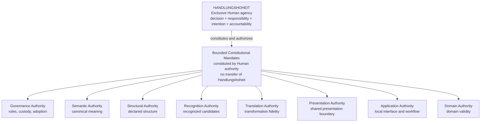

# Part II — Authorities

Status: `ADOPTED`

## Authority table

Architectural ownership means authority to issue or govern one bounded artifact
class. It does not give a software component agency, intention, accountability
or self-authorization.

| Authority | Purpose | Scope | Owner | Explicit exclusions | Dependencies |
|---|---|---|---|---|---|
| Semantic Authority | Establish canonical meaning | Vocabulary, definitions, semantic contracts and permitted semantic mappings | OLS | Recognition, structural certification, presentation, domain truth and Human decisions | Adopted governance, provenance and Human authorization |
| Structural Authority | Establish valid structural orientation | Declared representations, relations, navigation, orientation maps and structural expressions | ORION | Semantic redefinition, recognition generation, empirical truth, domain validity and Human approval | Declared source, OLS references and explicit ORION scope |
| Recognition Authority | Record what has been detected or selected | Patterns, representations, salience, framing, masking and references to declared operators | IRIS | Truth, importance, operator definition, certification and decision | Declared source, recognition scope and uncertainty record |
| Translation Authority | Assert fidelity of a transformation | Faithful conversion from one governed artifact into another declared form | Named producer of the Translation Record under applicable source authorities | New meaning, hidden repair, omitted uncertainty, certification and presentation authority | Source artifact, mapping identity, OLS meaning and structural provenance |
| Presentation Authority | Govern shared application-facing presentation boundaries | Packaging, interface conformance and faithful exposure of upstream status | SIRIUS | Application ownership, semantic modification, structural certification and decision | Translation Record and preserved provenance |
| Application Authority | Govern one independent application | Local interface, workflow, application state and bounded recommendations | Each application owner | OLS redefinition, ORION certification, IRIS recognition authority, domain truth and Human decision | SIRIUS boundary, applicable domain authority and governance |
| Domain Authority | Determine validity within a named field | Domain evidence, methods, acceptance criteria and domain conclusions | Identified domain owner or qualified domain authority | General semantic authority, ecosystem governance and validity outside the named domain | Evidence, declared protocol, expertise and accountable Human review |
| Governance Authority | Establish and change constitutional rules | Adoption, versioning, scope assignment, freezes, exceptions and authority custody | NEXAH governance under named Human approval | Scientific truth, automatic semantic definition, recognition and operational decision-making | Constitution and Human Handlungshoheit |
| Human Authority | Exercise an explicitly assigned Human mandate | Owner approval, review, rejection, exception and accountable judgment | Identified Human mandate holder | Unbounded authority outside the mandate; silent delegation to software | Applicable mandate, evidence and governance |
| Handlungshoheit | Unite decision, responsibility, intentional action and accountability | Final choice to act, not act, accept, reject, authorize, stop or assume responsibility | The identified Human | Possession by software; inference from recommendation; transfer through automation or consumption | None within the software architecture |

## Canonical distinction

```text
Human Authority
= bounded mandate

Handlungshoheit
= exclusive Human agency
 + intentional action
 + decision
 + responsibility
 + accountability
```

Human Authority describes jurisdiction. Handlungshoheit describes the exclusive
Human capacity through which that jurisdiction is intentionally exercised and
responsibility accepted.

## Authority map



All authorities beneath Handlungshoheit are bounded peers. The map does not
transfer Human agency to them and does not establish technical or execution
order.
