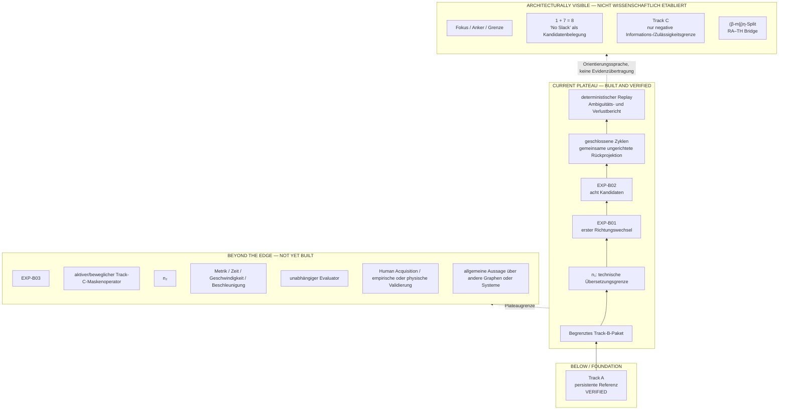

# TRACK B PLATEAU VIEW

## Trace → Motion Translation, EXP‑B01 bis EXP‑B02

Status: `DOCUMENTATION FREEZE — REVIEWED TECHNICAL CHECKPOINT`

Geltungsbereich: synthetische technische Erprobung. Kein wissenschaftliches
Bewegungsmodell, keine physikalische Bestätigung und keine Human Acquisition.

## 1. Executive Plateau Statement

> Track B hat ein erstes belastbares technisches Plateau erreicht. Aus einer
> begrenzten ungerichteten Trace-Geometrie wurde über die technische
> Übersetzungsgrenze (n₁) der vollständige endliche Raum von acht kompatiblen
> Start-/Richtungsdurchläufen erzeugt. Alle acht Kandidaten projizieren auf
> dieselbe ungerichtete Geometrie zurück. Das Plateau beschreibt einen
> reproduzierbaren Repräsentationswechsel, kein wissenschaftliches
> Bewegungsmodell.

Der achtteilige Kandidatenraum wurde in EXP‑B02 vollständig erzeugt, geprüft
und zweimal bytegenau reproduziert.

Damit wurde weder die ursprüngliche Bewegungsrichtung rekonstruiert noch eine
physikalische Bewegung bewiesen. Zeit und Geschwindigkeit wurden nicht
rekonstruiert. Es wurde keine Äquivalenzklasse eingeführt und kein
wissenschaftliches Resultat behauptet.

## 2. Was gebaut und geprüft wurde

| Bestandteil | Tatsächlicher Stand | Evidenz |
| --- | --- | --- |
| Track‑A-Referenz | Unverändert; 324 Bytes; eingefrorener SHA‑256 | [`trace_canonical.csv`](dry_run/minimal_trace_run/primary/trace_canonical.csv) |
| Track‑B-Eingang | Autorisiertes richtungsloses Vier-Knoten-/Vier-Kanten-Zykluspaket | [EXP‑B02 Input Packet](dry_run/track_b_exp_b02/EXP_B02_INPUT_PACKET.json) |
| `n₁` | Provisorische technische Übersetzungsgrenze, ohne physikalische oder symbolische Autorität | [EXP‑B01 Report](dry_run/track_b_exp_b01/EXP_B01_REPORT.json) |
| EXP‑B01 | Erster gerichteter Split mit zwei kompatiblen Gegenrichtungen | [deutscher EXP‑B01-Bericht](dry_run/track_b_exp_b01/EXP_B01_REPORT_DE.md) |
| EXP‑B02 | Vollständige Enumeration von vier Startknoten mal zwei Richtungen | [EXP‑B02 Report](dry_run/track_b_exp_b02/EXP_B02_REPORT.json) |
| Kandidatenidentitäten | Acht stabile technische IDs und geordnete geschlossene Knotenfolgen | [Motion Candidates](dry_run/track_b_exp_b02/EXP_B02_MOTION_CANDIDATES.json) |
| Vorwärtsprojektion | Für jeden Kandidaten ausgeführt; gemeinsame ungerichtete Geometrie erhalten | [Forward Projections](dry_run/track_b_exp_b02/EXP_B02_FORWARD_PROJECTIONS.json) |
| Kandidatenbeziehungen | Jeder fokussierte Kandidat referenziert sieben kompatible Alternativen | [Candidate Relations](dry_run/track_b_exp_b02/EXP_B02_CANDIDATE_RELATIONS.json) |
| Determinismus | Interner Replay und zwei vollständige externe Wiederholungen byteidentisch | [deutscher EXP‑B02-Bericht](dry_run/track_b_exp_b02/EXP_B02_REPORT_DE.md) |
| Informationsverlust | Ambiguität und nicht rekonstruierbare Informationen explizit dokumentiert | [EXP‑B02 Report](dry_run/track_b_exp_b02/EXP_B02_REPORT.json) |

`REVIEWED CHECKPOINT` bedeutet in diesem Bericht: als begrenztes technisches
Ergebnis angenommen. Der Ausdruck bedeutet keine wissenschaftliche Bestätigung
einer Bewegungsphysik.

## 3. Vollständiger achtteiliger Kandidatenraum

Die committed technische Reihenfolge lautet exakt:

```text
B02-S01-D01: N00 → N01 → N03 → N02 → N00
B02-S01-D02: N00 → N02 → N03 → N01 → N00
B02-S02-D01: N01 → N00 → N02 → N03 → N01
B02-S02-D02: N01 → N03 → N02 → N00 → N01
B02-S03-D01: N02 → N00 → N01 → N03 → N02
B02-S03-D02: N02 → N03 → N01 → N00 → N02
B02-S04-D01: N03 → N01 → N00 → N02 → N03
B02-S04-D02: N03 → N02 → N00 → N01 → N03
```

`B02-S01-D02` ist der einzige exakte Treffer der vorhandenen
Track‑A-XY-Zeilenreihenfolge. Dieser Treffer ist ausschließlich eine
Vergleichsübereinstimmung. Er ist kein Beweis für ursprüngliche Richtung, Zeit,
Ursache oder physikalische Bewegung.

Alle acht Kandidaten bleiben einzeln erhalten. Sie werden nicht durch eine
Reversal-, Rotations-, Cyclic-Origin- oder Quotientenregel zusammengelegt.

## 4. Plateau View



Die drei Zonen sind nicht gleichrangig: Nur `BUILT AND VERIFIED` bezeichnet
ausgeführte technische Prüfungen. `ARCHITECTURALLY VISIBLE` bezeichnet
Hypothesen und Orientierungssprache. `NOT YET BUILT` bezeichnet keine
gegenwärtige Fähigkeit.

## 5. Dreierfeld ohne leere Position

| Rolle | Aktuelle Besetzung in EXP‑B02 |
| --- | --- |
| Anker | Track A / ungerichtete Referenz |
| aktiver Übersetzungsraum | Track B / acht gerichtete Kandidaten |
| Grenze | ausgeschlossene Zeit-, Richtungs-, Marker- und Herkunftsinformation |

Als begrenzte Architekturmetapher darf „No Slack“ hier nur Folgendes bedeuten:

> Wird einer der acht Kandidaten fokussiert, bleiben die sieben anderen als
> deterministisch referenzierbare kompatible Alternativen erhalten.

Das bedeutet nicht, dass acht physische Bewegungen gleichzeitig stattfinden.
„Flavor“ und „Fühler“ sind ebenfalls nur Architekturmetaphern. Keiner dieser
Begriffe ist ein kanonisches Datenfeld oder ein wissenschaftliches Ergebnis.

## 6. Persistenz, Variation und Verlust

| Kategorie | Inhalt |
| --- | --- |
| Persistent | Knoten, ungerichtete Kanten, Zyklusabschluss, gemeinsame Rückprojektion |
| Variabel | Startknoten, erster Nachbar, Durchlaufrichtung, technische Kandidaten-ID |
| Technisch gesetzt | lexikographische Ordnung, Serialisierung, unitless Phase |
| Nicht rekonstruierbar | intrinsischer Start, ursprüngliche Richtung, Zeit, Geschwindigkeit, Beschleunigung, Source Order, Marker, `tau`, `sample_uuid`, Herkunft, Ursache |
| Nicht behauptet | physikalische Bewegung, Naturgesetz, wissenschaftliche Metrik, physische Gleichzeitigkeit |

Die unitless Phase ist weder Zeit noch Geschwindigkeit noch physikalische
Bewegung. Die technische Enumerationsordnung ist keine Eigenschaft einer
zugrunde liegenden Bewegung.

## 7. Reifegrad- und Evidenzkarte

| Ebene | Status |
| --- | --- |
| Track‑A-Integrität | VERIFIED |
| begrenztes Track‑B-Eingangspaket | VERIFIED |
| EXP‑B01 Richtungswechsel | VERIFIED |
| EXP‑B02 Acht-Kandidaten-Enumeration | VERIFIED |
| gemeinsame ungerichtete Rückprojektion | VERIFIED |
| deterministischer Replay | VERIFIED |
| „No Slack“ als endliche Kandidatenbelegung | ARCHITECTURAL INTERPRETATION |
| ursprüngliche Bewegung | UNKNOWN |
| Zeit- und Geschwindigkeitsmodell | NOT BUILT |
| Track‑C-Operator | NOT BUILT |
| wissenschaftliche Bewegungsmetrik | NOT BUILT |
| empirische Validierung | NOT STARTED |
| wissenschaftliches Ergebnis | NONE |

Committed EXP‑B02-Statuswerte:

```text
TRACK_A_REFERENCE_INTEGRITY: PASS
TRACK_B_INPUT_BOUNDARY: PASS
N1_TRANSLATION_EXECUTED: PASS
EIGHT_CANDIDATES_ENUMERATED: PASS
CANDIDATE_IDENTITIES_UNIQUE: PASS
ALL_CANDIDATES_CLOSED: PASS
ALL_FORWARD_PROJECTIONS_EXECUTED: PASS
UNDIRECTED_GEOMETRY_PERSISTENT: PASS
ORDERED_XY_COMPARISON_EXECUTED: PASS
NO_EQUIVALENCE_RULE_INTRODUCED: PASS
ALTERNATIVE_SET_PRESERVED: PASS
DETERMINISTIC_REPLAY: PASS
AMBIGUITY_REPORTED: YES
INFORMATION_LOSS_REPORTED: YES
SCIENTIFIC_RESULT: NONE
HUMAN_ACQUISITION: PROHIBITED
```

## 8. Plateaugrenze

> Bis hierhin wurde gezeigt, dass eine ungerichtete geschlossene
> Vier-Knoten-Trace einen vollständig enumerierbaren Raum von acht verwurzelten
> und gerichteten Durchläufen zulässt. Nicht gezeigt wurde, welcher Durchlauf
> ursprünglich war, ob einer davon eine physische Bewegung beschreibt oder wie
> eine bewegliche Maske auf diesen Raum wirkt.

Spätere Interpretationen dürfen nicht rückwirkend als Ergebnis von EXP‑B01 oder
EXP‑B02 erscheinen.

## 9. Geplante, nicht autorisierte Folge

1. Documentation Freeze und Owner Review abschließen.
2. Forschungsfrage für die nächste Ebene isolieren.
3. Gesondert entscheiden, ob als Nächstes:
   - die Kandidatenstruktur auf andere synthetische Graphen generalisiert wird,
   - eine zulässige Vergleichsmetrik entwickelt wird oder
   - Track C als eigenständiger Maskenoperator spezifiziert wird.
4. Erst danach einen neuen Experimentprompt definieren.
5. Human Acquisition bleibt gesperrt, bis Governance, Protokoll und
   wissenschaftliche Begründung separat freigegeben sind.

Diese Liste autorisiert keine der genannten Arbeiten.

## 10. Verifikationsgrundlage

```text
EXP-B01 COMMIT:
e3027a6553feda951f0c666d2609236b25887080

EXP-B02 COMMIT:
ad78133b7dc7e27876ed37742dd3b0b1bbb96526

TRACK A:
324 Bytes
SHA-256:
8aadeeec4b4c8cd591a597aef59b8390585db7e8f6a5346e88b37bd41cbc71ce
```

## 11. Freeze Record

```text
TRACK_B_PLATEAU_REACHED: YES
EXP_B01_REVIEWED_CHECKPOINT: YES
EXP_B02_REVIEWED_CHECKPOINT: YES
TRACK_B_DOCUMENTATION_FREEZE: COMPLETE
```

Der Freeze verändert keine Experimentlogik, keinen Operator, keine Metrik und
keine wissenschaftliche Aussage. EXP‑B01 und EXP‑B02 bleiben unverändert.
