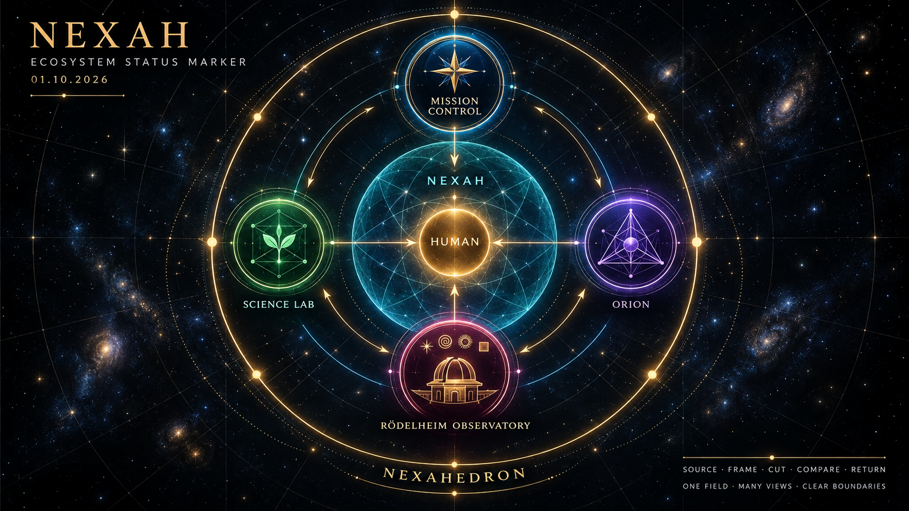

# Rödelheim Observatory — Crownpiece Instrument Gallery

**Status:** `CURATED_RELEASE_SELECTION / EXECUTABLE_VISUAL_FIXTURES / NO NEW EMPIRICAL CLAIM`

**Purpose:** a small public-facing route through the strongest executable
instruments in the Observatory release. This is a curated selection, not a
complete HTML inventory and not an activation of hosting, outreach or a shared
runtime.

The dated image is a visual status marker, not an authoritative architecture
diagram. Exact responsibilities and maturity remain governed by Mission
Control and the owning implementation records.

## Observatory promise

The instruments let a Human inspect how source, frame, cut, projection,
selection and return change what can be seen without silently turning a view
into scientific truth.

> One field. Several declared cuts. Visible transformations. Bounded claims.

## The four crownpieces

| Instrument | What the visitor can do | What it demonstrates | Status |
|---|---|---|---|
| [3+1 Dual Belt](../../EXPORTS/NEXAH_3_PLUS_1_DUAL_BELT.html) | move between inside and outside frames, masks, flows and observer views; export the current state | one source, three directed channels, a shared carrier, seam and return | G2 executable visual fixture |
| [MIWA · Pineal Aperture · Andromeda](../../EXPORTS/MIWA_PINEAP_AN_DROMEDA.html) | compare two carriers through a central aperture, change focus and masks, inspect selected figures, import a local star map and export an observer record | source-preserving multi-frame orientation, local selection and typed residual | Grid Grammar Level 2 executable visual fixture |
| [Root Space 8 → 16](../../EXPORTS/NEXAH_TESSERACT_ROOT_SPACE_8_TO_16.html) | inspect an eight-state carrier and its sixteen-state lift through the green bridge | a Q3/Q4 sign-state relation and its projected frame binding | executable frame fixture |
| [Tessarec · Qι Pearl](../../EXPORTS/NEXAH_TESSAREC_Q_IOTA_PEARL.html) | move the Q layer, direct the iota cut, change depth and aperture and run a declared visual orbit | carrier, directed cut, bounded Pearl aperture, local address view and typed return | executable frame fixture |

## MIWA as the central Observatory instrument

The release MIWA master contains a four-way camera focus — whole field, Milky
Way, Pineal Aperture and Andromeda — and seven named navigation frames:

1. Outside Carrier;
2. Earth Sky;
3. Solar System;
4. Saturn · Titan;
5. Uranus · Moons;
6. Green Bridge · Loki;
7. Closure Transit.

Its star-map importer reads a local CSV or JSON file inside the browser. The
file is not uploaded. Raw source fields remain distinct from the
carrier-normalized projection. The included
[CSV template](../../EXPORTS/MIWA_PINEAP_STAR_MAP_TEMPLATE.csv) contains demo
rows and documents the accepted schema.

A later preserved MIWA variant adds `E8 · AXIS08` and `Tessarec · Qι Pearl`,
bringing the navigator to nine frames. That variant is technically bounded in
the [E8 DEMOS validation report](../../CASE_STUDIES/E8_DEMOS_INTERACTIVE_ORIENTATION_2026-09-21/E8_DEMOS_VALIDATION_REPORT.md),
but it is not silently promoted over the seven-frame public release master.
The two revisions remain distinguishable.

## How to present each instrument

Every outward presentation should expose the same five layers:

1. **Experience** — open the executable HTML.
2. **Orientation** — explain the observer, frame, cut and controls briefly.
3. **Evidence** — link the exact implementation or validation record.
4. **Boundary** — state what the visual does not establish.
5. **Custody** — retain version, source pointer, hash and downloadable record.

The associated records are:

- [3+1 implementation](05_3_PLUS_1_DUAL_BELT_IMPLEMENTATION_RECORD.md);
- [MIWA implementation](06_MILKY_WAY_PINEAL_APERTURE_ANDROMEDA_IMPLEMENTATION_RECORD.md);
- [Tessarec and Root Space implementation](07_TESSAREC_ROOT_IOTA_FRAME_IMPLEMENTATION_RECORD.md);
- [release manifest](SHA256_MANIFEST.txt).
- [NEXAH Ecosystem Status Marker — 01.10.2026](../../EXPORTS/NEXAH_ECOSYSTEM_STATUS_MARKER_2026-10-01.png).

## Publication boundary

- These are orientation and representation instruments, not astronomical
  measurement pipelines or evidence of physical coupling.
- Imported catalogue data do not become authenticated merely by being loaded.
- Loki, Root Space and Tessarec are mathematical/interface frames, not literal
  physical four-dimensional objects.
- E8 and stellar positions are not asserted to be physically identical.
- Visual overlap, synchrony or closure is not causal evidence.
- This gallery authorizes no deployment, campaign, new empirical claim or
  product capability.

The gallery is ready to serve as the editorial entrance to a later Rödelheim
Observatory publication surface. Publication remains a separate Human Owner
decision.
